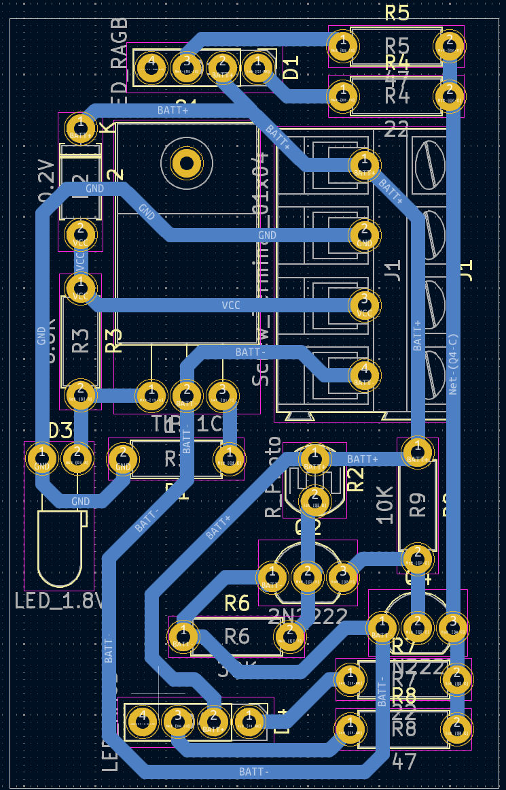

# Solar-Charged Minecraft Fox Lamp
***Description***: This sleep lamp is powered by two Ni-Cd cells wired in series for a total of 2.4V and can be charged using a small solar panel. The Red and Green LEDs of an RGB LED are used to produce the orange light, consuming ~30mA combined.

***Charging***: A transistor-based constant current circuit trickle-charges the two Ni-Cd cells at 60mA using a 9V solar panel.

***Usage***: The lamp provides approximately 16 hours of usable light on a full charge.

## [Schematic](schematic.pdf)

## PCB
***[PCB was etched at home using a PCB Pen Plotter attachment](https://github.com/furpectfox/PCB_Trace_Plotter)**  

## Finish

